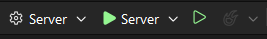
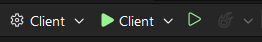
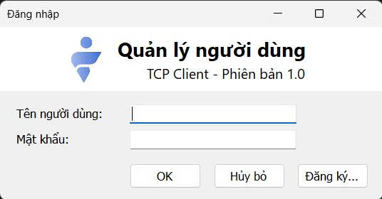
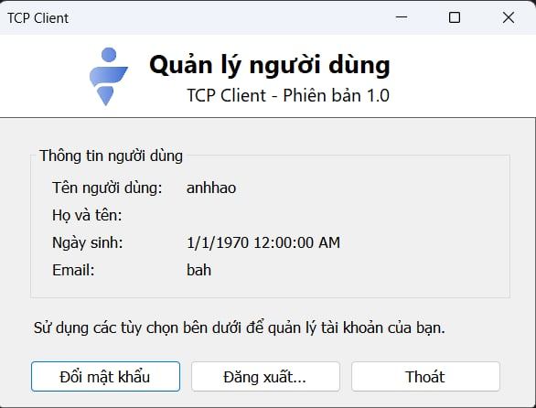
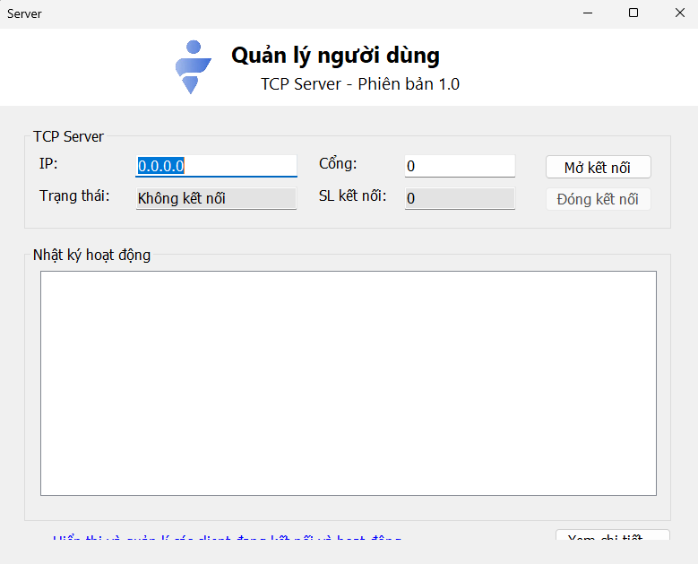
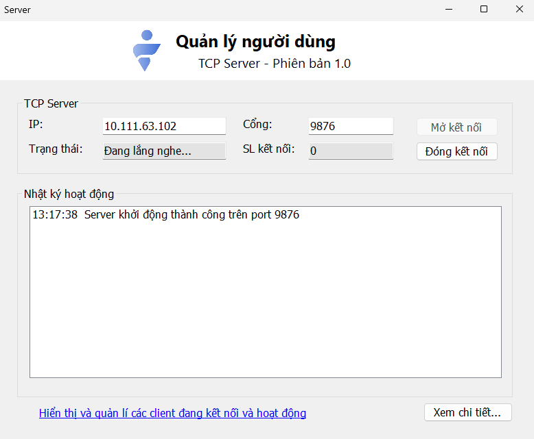
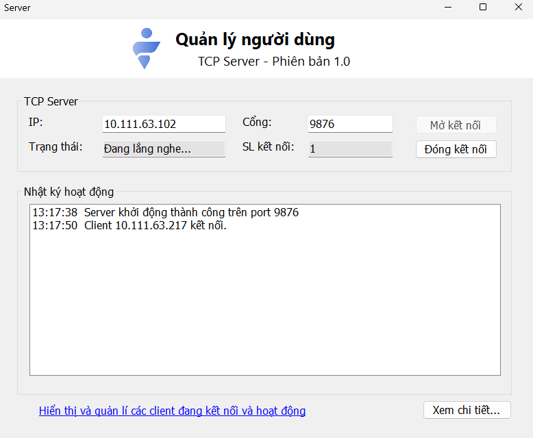
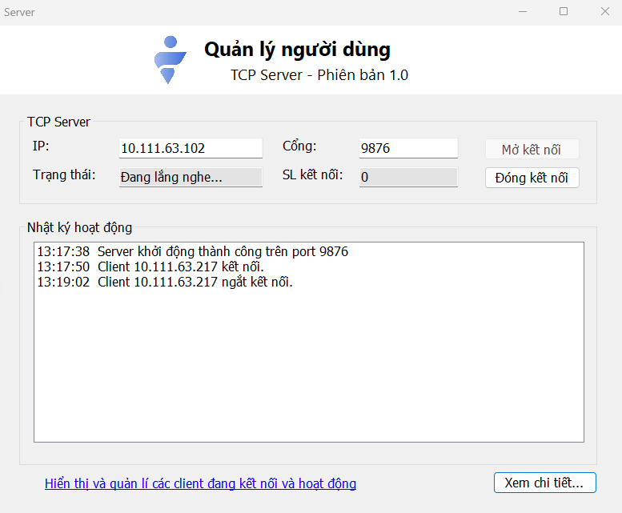

## Bài tập Multiple Socket Connection

### Cách sử dụng

1. Copy link HTTPS: https://github.com/ha1moi1/NT106.Q14-Group-1.git

   Clone dự án bằng lệnh: `git clone https://github.com/ha1moi1/NT106.Q14-Group-1.git`

2. Mở Command Prompt/Power Shell, gõ lệnh `ipconfig` rồi copy IPv4 Address của Mạng đang sử dụng:

**Server:**

+ Truy cập vào NT106.Q14-Group-1\Excercise3\UserManagement\Server.

+ Tìm File `App.config` rồi mở ra.

+ Tại dòng `connectionString="Data Source=127.0.0.1, 1433;`, thay thế địa chỉ IPv4 của `Data Source` bằng địa chỉ IPv4 vừa mới sao chép.

+ Lưu và đóng File lại.

**Client:**

+ Truy cập vào NT106.Q14-Group-1\Excercise3\UserManagement\Client.

+ Tìm File `App.config` rồi mở ra.

+ Tại dòng `<add key="ServerIP" value="127.0.0.1" />`, thay thế địa chỉ IPv4 của `value` bằng địa chỉ IPv4 vừa mới sao chép.

+ Lưu và đóng File lại.

3. Mở `UserManagement.sln`.

**Server:**

+ Chỉnh StartUp Project là Server

+ Chạy chương trình.

**Client:**

+ Chỉnh StartUp Project là Client

+ Chạy chương trình.

!!! **Lưu ý:** Client và Server phải kết nối chung một Mạng mới có thể chạy được chương trình.
### Các giao diện màn hình ứng dụng

#### Client

- Giao diện đăng nhập tài khoản 

- Giao diện đăng ký tài khoản 

- Giao diện sau đăng nhập

#### Server

- Giao diện Server

- Giao diện Server khi đang Listening

- Giao diện Server khi đã có Client kết nối thành công

- Giao diện Server khi đã có Client kết nối thành công

- Giao diện danh sách các Client đã kết nối tới Server

- Giao diện Server khi có Client ngắt kết nối

